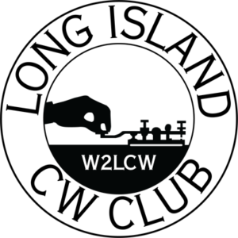

# Long Island CW Morse Practice Page Source Code Repository

What is this?

The **source code repository** for [Long Island CW Club's](https://longislandcwclub.org/) customized version of [SG Phillip's](https://morsecode.world/international/trainer/generator.html) (and by the way, please note that we've made a few tweaks to his [morse-pro js libraries](https://github.com/scp93ch/morse-pro)) It is available for use by anyone who wants to practice morse code and has many useful features, and also includes LICW's lessons that go along with some classes.

**If you are were just looking for the application itself and just want to start using it, go here:** https://longislandcw.github.io/morsebrowser/index.html

Or download https://longislandcw.github.io/morsebrowser/download/morse.zip and unzip somewhere on your device, then open index.html in your browser.

# Found a bug, or have a feature suggestion?

Feel free to make feature requests or bug reports using the "Issues" tab.https://github.com/LongIslandCW/morsebrowser/issues Note that you may need to open a github account. _Please respect the request to submit issues here on github rather than emailing the contributors directly_.

# Do you want to help code or just tinker with the code?

KN4YRM originally built it to be "ham tinkerer-friendly." This means it isn't built with the latest-and-greatest software development tools and techniques, but rather some compromises were made so the code might be approachable to a non-professional audience of hams who might want to tinker with it. For example, frameworks with steep learning curves might be easy for KN4YRM to work with, but hard for a non-professional software programmer to pickup. So for example, instead of react.js or angular.js, a beginner-friendly knockout.js https://knockoutjs.com/ was selected. Currently, it can best be described as knockout.js with bootstrap https://getbootstrap.com/ styling, with webpack used for builds (sourcemaps enabled so tinkerers can see how it works). This decision was also made so that ongoing future maintenance and feature requests aren't dependent on one person. KN4YRM suggests over time not losing sight of this philospohy for this project. Hams are encouraged to tinker with it and make pull requests.

It's suggested that if you want to help:
- tinkering with look and feel: https://getbootstrap.com/  and look at src/index.html 
- functionality: you'll need to know some javascript and especially https://knockoutjs.com/ and look at src/morse.js
- other genric tools of which you'll need some basic understing: node, npm, webpack, eslint, git (and github if you want to constribute)
- KN4YRM used VSCode as his IDE for this project
- Please create a feature branch off of develop, and submit a pull request to merge into develop if you have code to contribute.
